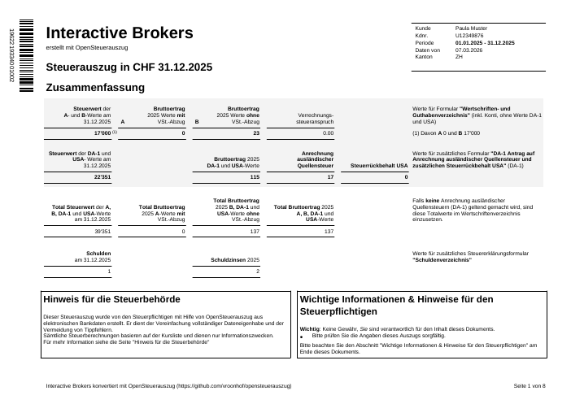
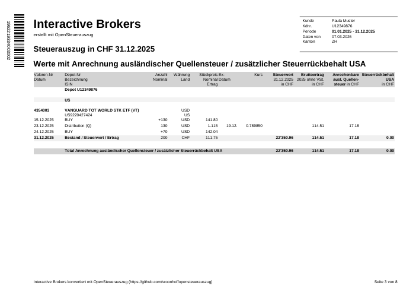

# OpenSteuerAuszug

A Python package for generating Swiss tax statements (Steuerauszüge) from the statements of brokers that don't support it, e.g. mostly foreign ones.
The goal is to eliminate tedious and error-prone manual typing into the tax software.

## About this fork

This is Tristan's fork ([TMLoew/opensteuerauszug](https://github.com/TMLoew/opensteuerauszug)) of [vroonhof/opensteuerauszug](https://github.com/vroonhof/opensteuerauszug). The fork focuses on **Kanton St. Gallen** filings and adds a human-readable dashboard alongside the standard tax-software-importable output. Core licensing and pipeline stay aligned with upstream.

**Upstream provides (unchanged here):**
- Broker import for Interactive Brokers and Charles Schwab
- eCH-0196 XML generation and PDF rendering with PDF417 barcode
- Manual price management (year-specific CSV files) and the Kursliste integration
- Desktop GUI (`opensteuerauszug-gui`) and cross-verification of existing Steuerauszüge

**This fork adds:**
- A new CLI subcommand `steuerauszug tax-overview` that emits three artifacts per run: an xlsx workbook, a self-contained HTML dashboard, and a one-page PDF cover (see [docs/tax_overview.md](docs/tax_overview.md))
- A **Kanton SG Wertschriftenverzeichnis** mapping sheet, with column A/B classification driven by ISIN domicile (CH/LI → A, foreign → B) so it transfers 1:1 onto Formular 2
- A **DA-1 Hilfstabelle** for foreign withholding-tax reclaim with treaty-rate ceilings applied
- A **Vermögenszuwachs waterfall** that reconciles opening + inflows − outflows = closing value within ±CHF 1 against the ESTV Kursliste Steuerwert
- A **Performance dashboard** (HTML, PDF page 2, xlsx Performance sheet) with per-position P&L, sector / currency allocation, and benchmark comparison (SPI / SMI / SPX / MSCI World) — securities-only Modified-Dietz return, computed independently of unknown opening cash
- Native **embedded charts** (BarChart, PieChart) in the xlsx Performance sheet so Excel/LibreOffice render the same visuals as the HTML
- **Year-over-year linking** via `--prior-year-input <path>`: the prior year's Kursliste-derived closing values become the current year's opening, eliminating the "earliest mutation price" trap when broker exports omit `startingCash` and per-mutation FX
- A sticky **HTML dashboard nav** with section anchors and per-section counts so reviewers can jump between Übersicht, Performance, Wertschriften, SG-Verzeichnis, DA-1, etc. in one document
- A preparer-only **ESTV Kreisschreiben Nr. 36** (gewerbsmässiger Wertschriftenhandel) self-check, gated behind `--preparer-mode` so non-preparer exports are safe to hand to a tax clerk
- A committed synthetic [sample HTML dashboard](docs/samples/tax_overview/sample_dashboard.html) regenerable via `scripts/generate_tax_overview_samples.py`

Bug reports for the tax-overview mode or SG-specific behaviour belong in this fork. Issues with the core eCH-0196 pipeline should go upstream.

## Disclaimer

- The package is not formally audited
- The main focus is on getting core transaction and interest data
- These need to be verified by the user before submitting with the tax return
- Tax values are computed best effort for informational purposes (the main Tax software should be able to compute it from the core transaction data)
- The [standalone web app](docs/webapp.md)'s browser wizard is a separate, mostly AI-coded UI layer and has seen much less real-world testing than the Python/CLI version. Prefer the CLI if you can install it.

For more information on required due diligence see the [User Guide](docs/user_guide.md).

## Quick Start

### Desktop GUI (Recommended)

The easiest way to use OpenSteuerAuszug is through the native macOS desktop GUI:

```bash
# Install with GUI dependencies
pip install -e ".[gui]"

# Launch the GUI
opensteuerauszug-gui
```

**Features:**
- **Native macOS integration** - Automatic dark mode, native fonts, and macOS shortcuts
- **Automatic price extraction** - Prices are automatically extracted from IBKR OpenPosition data
- **Drag & drop** - Simply drop your broker XML file onto the window
- **Simple mode (default)** - Just select your file, broker, and year - done!
- **Expert mode (⌘E)** - Full CLI parity with all advanced options
- **Real-time logs** - Watch the generation process with live output
- **Year-specific manual prices** - Automatically saves and applies manual prices per tax year
- **Visual indicators** - Securities using manual prices are marked with asterisks (*) in the PDF
- **Bilingual warnings** - Important notices appear in both English and German

See [GUI_GUIDE.md](GUI_GUIDE.md) for detailed GUI documentation.

### Command Line Interface

After installing, use the [User Guide](docs/user_guide.md) as the main
walkthrough. It covers quick start, preparation steps, broker data export,
and complete command examples.

**Security note:**
- Keep personal settings in a local file such as `config.local.toml` and select it in GUI Expert mode (or CLI `--config config.local.toml`)
- Local sensitive artifacts are ignored via `.gitignore` (`data/*.xml`, `out/*`, manual price files, `.envrc`, etc.)
- If your local `config.toml` or `data/security_identifiers.csv` contains personal data, do not include those edits in commits (they are tracked files)

### Verifying an Existing Steuerauszug

The tool can also be used to cross check and existing existing Steuerauszug (eCH-0196 XML). See See [verify instructions](docs/verify_existing.md).

### Tax Overview Mode (Kanton SG dashboard)

Alongside the standard eCH-0196 output, OpenSteuerAuszug can generate a
**tax-authority-friendly dashboard** tailored to Kanton St. Gallen filings.
It produces three artifacts per run — an xlsx workbook, an HTML report, and
a PDF cover — that expose realized gains, dividend / interest breakdowns,
the Vermögenszuwachs waterfall, and DA-1-ready foreign withholding-tax
figures on one page.

```bash
steuerauszug tax-overview \
  --input data/ibkr_2025.xml \
  --broker ibkr \
  --year 2025 \
  --output-dir out/ \
  --prior-year-input data/ibkr_2024.xml   # optional, anchors opening to prior Kursliste
```

Key properties:
- CHF figures use the ESTV Kursliste (daily FX rates and per-ISIN
  Steuerwerte) so they match what the tax office will compute.
- The Vermögenszuwachs waterfall reconciles against the eCH-0196 closing
  total within ±CHF 1.
- KS 36 (gewerbsmässiger Wertschriftenhandel) self-check sheets are kept
  out of non-preparer exports by default — pass `--preparer-mode` to
  include the hidden `_KS36_*` sheets in the workbook and the equivalent
  KS 36 section in the HTML report.
- The HTML report is a single self-contained document (no external
  stylesheets or scripts) that shares the workbook's palette and Swiss
  number formatting, so the two views stay visually consistent.
- The PDF cover is a single-page executive summary (headline KPIs,
  Vermögenszuwachs waterfall, reconciliation marker) intended for paper
  submission or a first-look email — the full detail lives in the xlsx.

Workbook sheets (left-to-right): `Übersicht`, `Wertschriften`,
`SG_Verzeichnis` (copy-paste into the Kanton SG Wertschriftenverzeichnis
form), `DA1_Hilfstabelle` (foreign withholding-tax reclaim table),
`Kauf_Verkauf`, `Dividenden`, `Zinsen`, `Gebühren`, `FX_Kurse`.

See the dedicated [Tax Overview guide](docs/tax_overview.md) for the
full sheet-by-sheet reference, reconciliation semantics, third-party
safety invariants, and a committed [synthetic sample HTML dashboard](docs/samples/tax_overview/sample_dashboard.html).

### Appending Additional Documents

You can attach original broker statements or other supporting documents to the generated PDF using `--pre-amble` and `--post-amble` options. See the [User Guide](docs/user_guide.md#appending-additional-documents) for details.

## Features

### Core Functionality
- **Import broker data** - Provide transaction and position data in [ECH-0196](https://www.ech.ch/de/ech/ech-0196/2.2.0) compliant format
- **Automatic price extraction** - Extract year-end security prices from IBKR OpenPosition data
- **Manual price management** - Year-specific CSV files for securities not in official Kursliste
- **Tax calculations** - Simple tax approximations for informational purposes
- **Cross verification** - Verify calculations against existing E-Steuerauszug data
- **PDF generation** - Create standardized formatted PDFs that can be imported into Tax Software
- **Visual indicators** - Securities using manual prices are clearly marked in the output

### Automation Scripts
- **Automatic price updates** - Scripts to extract and update manual prices from broker data
- **Yahoo Finance integration** - Fetch current prices for securities with tickers
- **Workflow automation** - Combined scripts for end-to-end price management

See [USAGE.md](USAGE.md) and [scripts/README.md](scripts/README.md) for details.

## Sample Output

Below are previews from a sample Steuerauszug generated from the [VT and Chill](tests/samples/import/ibkr/vtandchill_2025.xml) IBKR test data.

| Summary page (p.1) | Stock table (p.3) |
|---|---|
|  |  |

[📄 Download full sample PDF](docs/sample_output.pdf)

[📄 Download full sample ECH-0196 XML](docs/sample_output.xml)

## Supported Brokers

For now the focus is on brokers / banks that the author has 

- Charles Schwab (main trading account and Equity Awards)
- Interactive Brokers

Thanks to community contributions we also support

- DEGIRO (contributed by [@manuelgr0](https://github.com/manuelgr0), with multilingual support by [@dalpozz](https://github.com/dalpozz) and [@VincentBlondeau](https://github.com/VincentBlondeau))

Additionally we can recalculate and verify any existing steuerauszug (this is mostly to increase confidence in the software itself)

## Related work and alternatives

[Datalevel](https://www.datalevel.ch/en/) offers a very [similar solution for IBKR](https://www.datalevel.ch/en/loesungen) as a paid service (reasonable yearly flat fee). It is a SaaS solution that requires online access to the flex API for your account. They are from the Swiss banking ecosystem so they use the shared Java rendering libraries which makes things look a bit more standard. They suffer from of the same issues as well, like this project they are not actually the official bank. If you need no hassle, this could be it.

[zh-tax-csv-import](https://github.com/stefanloerwald/zh-tax-csv-import) is a chrome extension also imports Schwab and Interactive Broker statements, but then fills in directly on the tax forms. This is less clean and more brittle, but once done the Tax office sees no difference to manual entry. As an upside the tax declaration remains an authoritative list of all your investments and accounts. 

Agentic browsers are getting very close just be able to do the above all by themselves.

The [EWV](https://www.ewv-ete.ch/de/ewv-ete/) and SSK publish a [shared set of tools](https://forum.mustachianpost.com/t/programmatic-tax-return/11908/69) that is even referenced in the spec. This used to available online, but is now locked down to a cabal of banks and tax officials. Inquiring minds however have noticed that the JAR is [included in nearly every offline official Tax software](https://mkiesel.ch/posts/swiss-tax-adventures-1/). It includes an official sample renderer for the PDF version given an XML file, so you could also use that instead of the python renderer. It will look a bit more official. I wasn't aware this existed and had to reconstruct from scratch as well as fix a lot of the python PDF417 libraries. The spec refers to the library as open source but non of these actually include the source.

## Installation

### Standalone web app (no installation)

OpenSteuerAuszug also runs as a **single HTML page in your browser** — open
**<https://vroonhof.github.io/opensteuerauszug/>** and a wizard guides you
through the steps (or save the page locally and open it from disk). Your
financial data never leaves your computer. See the
[web app guide](docs/webapp.md) for details.

This needs newer versions of pdf417gen and (for testing) pdf417decoder than
are available on PyPI — these are pulled in from vroonhof's vendored git branches
automatically. The fork's tax-overview mode additionally pulls in `openpyxl`
(xlsx workbook export) and `jinja2` (HTML dashboard rendering); both are
declared in `pyproject.toml` so regular `pip install` picks them up.

### Quick install (recommended for users)


# One-time install of the CLI via uv
```console 
uv tool install --from git+https://github.com/vroonhof/opensteuerauszug.git opensteuerauszug

# Then run normally (without pixi, or after . ./scripts/setup_pixi.sh)
opensteuerauszug --help
```

Install `uv` first: https://docs.astral.sh/uv/getting-started/installation/

`uv` can also install/manage Python for you, so you usually do not need a
separate Python setup step.

For one-off runs without installing the tool, you can also use:

```console
uv run --with git+https://github.com/vroonhof/opensteuerauszug.git opensteuerauszug --help
```

Then continue with the [User Guide](docs/user_guide.md).

### Development install [option 1] (contributors: using uv)

For development and tests, install from source:

```console
git clone https://github.com/vroonhof/opensteuerauszug.git
cd opensteuerauszug
uv sync --locked --extra dev
```
### Development install [option 2] (contributors: using [pixi](https://pixi.prefix.dev/latest/))
```console
git clone https://github.com/vroonhof/opensteuerauszug.git
cd opensteuerauszug
. ./scripts/setup_pixi.sh
```

### Verifying the generated XML

When you export the final XML using `--xml-output`, you can validate it
against the official eCH-0196 schema with common XML tools.  Examples:

```bash
# Using libxml2
xmllint --noout --schema specs/eCH-0196-2-2.xsd output.xml

# Using a Java based validator (Jing)
java -jar jing.jar specs/eCH-0196-2-2.xsd output.xml
```

## Scripts and Tools

This project includes various scripts for data processing, testing, and utility tasks.
For detailed documentation on available scripts, including the Kursliste filtering tool, see the [Scripts Readme](scripts/README.md).

## Development

### Setup

To set up the locked development environment with uv:

```bash
uv sync --locked --extra dev
```

To set up the development environment (pixi):

```bash
. ./setup_pixi.sh
```

### Testing

```console
uv run --locked --extra dev pytest tests/
```

To update all dependencies and regenerate both the uv-specific and standard
PEP 751 lock files:

```console
./scripts/update_lockfiles.sh --upgrade
```

If the environment variable `EXTRA_SAMPLE_DIR` points to a directory with XML files these are validated as part of a set of integration sets. See the [verify](docs/verify_existing.md) documentation for how to invoke that manually.

### Developer Scripts

This project includes utility scripts for development and data management. For detailed information on these scripts, please see the [Scripts Documentation](scripts/README.md).


### Code quality and AI usage.

This project exists in part for me to try out AI based coding outside of $WORKPLACE to try out various tools. As a result code quality and style is inconsistent and contains various AIisms. Code has been cleaned-up, reviewed and controlled by me where it matters.

That said all mistakes, hallucinations etc are probably mine.

The [standalone web app](docs/webapp.md) is a particularly heavy case: the browser-side
wizard (`web/app_template.html` and its JS) is mostly AI-generated and has had far less
real-world exercise than the core library and CLI. Treat it as more experimental.

## Related projects

- https://github.com/stefanloerwald/zh-tax-csv-import : if you want an
  automated import that controls PrivateTax directly. It is more hacky but leaves no trace for the tax office to be confused about.
- https://github.com/BrunoEberhard/open-ech-taxstatement : An old project I only discovered later that contains a model defintion of the Tax data targeting Java. The author has since left the Swis open data efforts.
- https://github.com/KapJI/capital-gains-calculator : UK Capital Gains Tax calculator
  supporting Charles Schwab, Interactive Brokers, and others. Thanks to
  [@KapJI](https://github.com/KapJI) and contributors for the comprehensive Schwab
  transaction type coverage and sample data that helped improve our importer. Their
  test data serves as a useful source of example inputs for many importers.


## Acknowledgements

Many thanks to everyone who has tested this tool with their own data and contributed fixes and improvements.

Special thanks to [@pet-zh](https://github.com/pet-zh), whose extensive real-world testing and numerous fixes have made the output significantly more polished and reliable.

The DEGIRO importer is a community effort: contributed by [@manuelgr0](https://github.com/manuelgr0), with multilingual support by [@dalpozz](https://github.com/dalpozz) and improved French support plus test data by [@VincentBlondeau](https://github.com/VincentBlondeau).

## License

See [LICENSE](LICENSE) file.

Though I am not formally requiring it to keep things simple, I would prefer if you dropped me a line if this package being used or included in other software or other service (e.g. if you are financial service provider).
